# 💬 Real-Time Messenger App 'Ville'

A comprehensive, modern messaging application built with Laravel Reverb websockets and React, offering real-time communication, advanced user management, and rich media sharing capabilities.

## ✨ Key Features Overview

**Ville** is a full-featured messaging platform designed for both personal and professional communication, featuring real-time websocket connections, comprehensive user management, and a beautiful responsive interface.

## 📸 Project Gallery

See the project in action with these high-quality screenshots. Alternatively you can navigate to public/screenshots directory to view all the screenshots

<div style="display: flex; flex-wrap: wrap; gap: 10px;">
  
  
  
  
</div>

*Click on any image to view full size*

## 🎯 Core Functionality

### 🔍 User Discovery & Social Features
- **Advanced User Search** - Discover users across the platform with intelligent search functionality
- **Follow System** - Follow users to add them to your conversation list for easy access
- **Profile-based Messaging** - Access direct messages directly from any user's profile page
- **User Administration** - Add new users to the system, block/unblock problematic users, and assign or revoke admin permissions

### 💬 Messaging & Communication
- **Real-Time Messaging** - Instant message delivery using Laravel Reverb websocket server for seamless conversations
- **Group Conversations** - Create and manage group chats with multiple users for team collaboration or social interactions
- **Message Reactions** - Express yourself with emoji reactions on messages for enhanced engagement
- **Message Control** - Delete your own sent messages with full conversation state management
- **Markdown Support** - Rich text formatting with markdown support for enhanced message styling

### 📁 Rich Media & File Sharing
- **Comprehensive File Support** - Share images, videos, documents, and audio files with full preview capabilities
- **Dual View Modes** - Preview files in both compact and full-screen modes for optimal viewing
- **Audio Messages** - Record and send audio messages directly within the interface using quick-access recording buttons
- **Drag & Drop Upload** - Intuitive file sharing with drag and drop functionality

### 🔄 Advanced Features
- **Infinite Scroll History** - Access older messages through efficient infinite scroll loading for seamless conversation browsing
- **Background Job Processing** - Resource-intensive operations like group deletion run as background jobs with real-time websocket notifications
- **Profile Management** - Update personal profile details including name, email, password, and profile picture
- **Responsive Design** - Fully responsive UI that works seamlessly across all device sizes, from mobile to desktop

### 🔐 Security & Administration
- **User Access Control** - Comprehensive user management with blocking and admin permission systems
- **Authentication System** - Robust user authentication with Laravel Sanctum
- **Admin Dashboard** - Administrative tools for user and system management

## 🛠️ Tech Stack

**Frontend:**
- React 18+ with modern hooks
- Inertia.js for seamless SPA experience
- Tailwind CSS for responsive styling
- Lucide React icons
- Vite for fast development builds

**Backend:**
- Laravel 11+ with modern PHP features
- MySQL 8.0 for reliable data storage
- Redis for caching and session management
- Laravel Sanctum for API authentication
- Laravel Queues for background processing

**Real-time Communication:**
- Laravel Reverb for websocket broadcasting
- Real-time message delivery
- Live user presence indicators
- Instant notification system

**Infrastructure:**
- Docker & Docker Compose for containerized deployment
- Nginx as reverse proxy and web server
- Varnish cache layer for performance optimization
- Supervisor for process management

## 🚀 Quick Start with Docker (Recommended)

The easiest way to run Ville is using Docker. The entire stack — PHP, MySQL, Redis, Nginx, Varnish, WebSockets, and Queue Worker — starts with a single command.

### Prerequisites
- [Docker](https://docs.docker.com/get-docker/) installed
- [Docker Compose](https://docs.docker.com/compose/install/) installed
- Git

### Installation

```bash
# Clone the repository
git clone https://github.com/OburuO/ville-messenger-app.git
cd ville-messenger-app/docker

# Run the setup script (generates SSL certs, creates .env, sets permissions)
chmod +x setup.sh
./setup.sh

# Start all services
chmod +x start.sh
./start.sh
```

That's it! The following services will be running:

| Service | URL |
|---------|-----|
| Main App | http://localhost |
| App (HTTPS) | https://localhost |
| WebSocket | wss://localhost:8081 |
| Varnish Cache | http://localhost:8080 |
| MySQL | localhost:3306 |
| Redis | localhost:6379 |

### View Logs

```bash
chmod +x logs.sh
./logs.sh
```

### Default Login Credentials

After running the database seeder, you can log in with these default accounts:

**Administrator Account:**
- **Email:** `john@example.com`
- **Password:** `password`
- **Role:** Admin (full access to user management and administrative features)

**Regular User Account:**
- **Email:** `jane@example.com`
- **Password:** `password`
- **Role:** Standard user

> ⚠️ **Security Note:** Remember to change these default passwords in production environments!

## 🔧 Manual Installation (Without Docker)

### Prerequisites
- PHP 8.2+
- Node.js 18+
- MySQL 8.0+
- Redis server
- Composer

### Steps

```bash
# Clone the repository
git clone https://github.com/OburuO/ville-messenger-app.git
cd ville-messenger-app

# Install dependencies
composer install
npm install

# Environment setup
cp .env.example .env
php artisan key:generate

# Database setup
php artisan migrate:fresh --seed

# Storage setup
php artisan storage:link
```

### Start Development Services

```bash
# Terminal 1 - Laravel development server
php artisan serve

# Terminal 2 - Laravel Reverb websocket server
php artisan reverb:start

# Terminal 3 - Queue worker for background jobs
php artisan queue:listen

# Terminal 4 - Frontend development server
npm run dev
```

### Production Build

```bash
# Build frontend assets
npm run build

# Optimize Laravel
php artisan config:cache
php artisan route:cache
php artisan view:cache

# Start production services
php artisan reverb:start --host=0.0.0.0 --port=8080
php artisan queue:work --daemon
```

## 🔧 Configuration

### Environment Variables

```env
# Application
APP_NAME=Ville
APP_ENV=local
APP_DEBUG=true
APP_URL=http://localhost

# Database
DB_CONNECTION=mysql
DB_HOST=127.0.0.1
DB_PORT=3306
DB_DATABASE=socioville
DB_USERNAME=root
DB_PASSWORD=

# Redis
REDIS_HOST=127.0.0.1
REDIS_PORT=6379

# Broadcasting (Reverb)
BROADCAST_DRIVER=reverb
REVERB_APP_ID=ville-app
REVERB_APP_KEY=ville-key
REVERB_APP_SECRET=ville-secret
REVERB_HOST=localhost
REVERB_PORT=8081
REVERB_SCHEME=https

# File Storage (local)
FILESYSTEM_DISK=local
```

> 📁 **File Storage:** Ville uses local storage by default. Files are stored in the `storage/app/public` directory and served via Laravel's storage link.

## 🏗️ Architecture

Ville is built with a modern, scalable architecture:



- **Frontend**: React SPA with Inertia.js for seamless navigation
- **Backend**: Laravel API with robust authentication and authorization
- **Real-time**: Laravel Reverb provides reliable websocket connections
- **Database**: Optimized MySQL schema with proper indexing
- **Caching**: Redis for session management and performance optimization
- **Queue System**: Background job processing for resource-intensive operations
- **Proxy**: Nginx reverse proxy with SSL termination
- **Cache Layer**: Varnish for HTTP caching and performance

## 📱 User Experience

### Getting Started
1. **User Registration** - Create your account or use the default credentials above for testing
2. **Profile Setup** - Add your profile picture and personal details
3. **Discover Users** - Use the search feature to find and follow other users
4. **Start Conversations** - Begin messaging directly from user profiles or create group chats
5. **Rich Communication** - Share files, react to messages, and enjoy real-time interactions

### Interface Highlights
- **Dark Theme** - Modern dark interface optimized for extended use
- **Intuitive Navigation** - Clean, user-friendly design with logical flow
- **Mobile First** - Responsive design that works perfectly on all devices
- **Real-time Updates** - Instant message delivery and user status updates
- **Rich Media Preview** - In-line previews for images, videos, and documents

---

**Built by Brandon Oburu**

*Ville - Where conversations come alive in real-time*